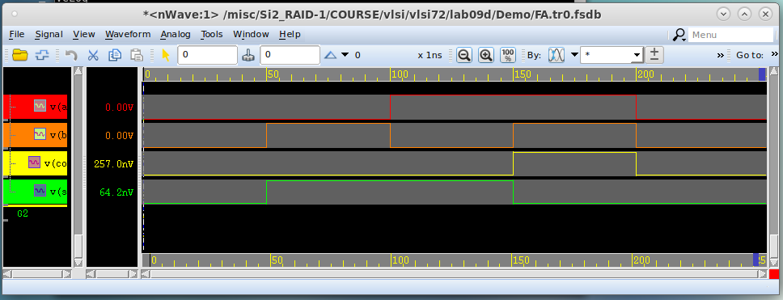
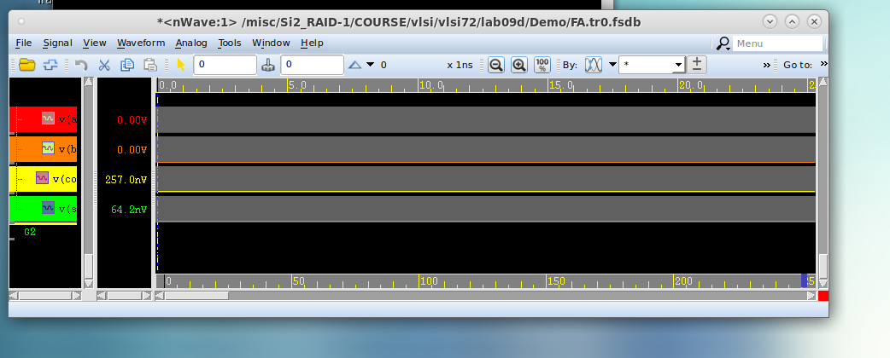
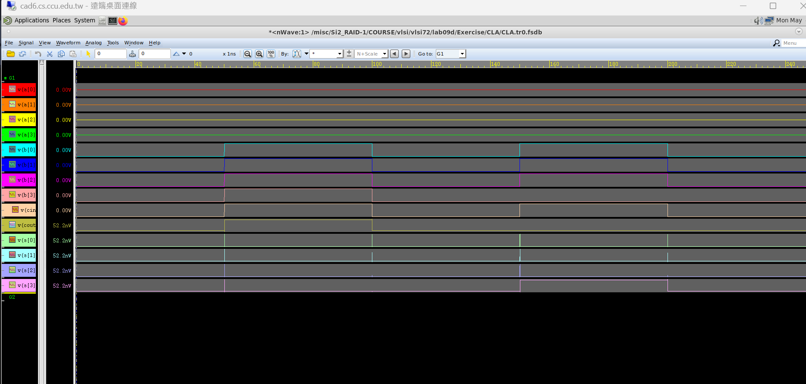

# Lab 09D：HSPICE Simulation of Different Adder Architectures 實驗報告

## 一、實驗目的

本實驗使用 HSPICE 模擬不同加法器架構，包含：

1. 1-bit Full Adder
2. 4-bit Ripple Carry Adder，RPA
3. 4-bit Carry Look-Ahead Adder，CLA

實驗主要目的為：

- 了解如何使用 HSPICE 執行 transient simulation。
- 量測加法器的 propagation delay。
- 量測 average power 與 maximum power。
- 觀察不同 PVT condition 對 1-bit full adder 的影響。
- 比較 4-bit RPA 與 4-bit CLA 的 delay 與 power。
- 使用 nWave 觀察輸入與輸出波形，確認電路功能正確。

## 二、實驗環境

| 項目 | 內容 |
| --- | --- |
| Tool | PrimeSim HSPICE |
| Waveform Viewer | nWave |
| Simulation type | Transient Analysis |
| Default process | TT |
| Default voltage | 0.8 V |
| Default temperature | 25°C |
| Simulation time | 250 ns |

## 三、1-bit Full Adder Simulation

### 3.1 解壓縮與進入 Demo 資料夾

使用以下指令取得 lab 檔案並進入 Demo 目錄：

```bash
tar zxvf ~visita/lab09d.tar.gz
cd Demo
```

### 3.2 開啟 FA.sp

```bash
gedit FA.sp &
```

在 `FA.sp` 中可以看到 operation condition：

```spice
*** Process: Typical ***
.PARAM supply=0.8
.TEMP 25

.TRAN 1ps 250ns
```

此設定代表：

| 項目 | 數值 |
| --- | --- |
| Process | Typical TT |
| Voltage | 0.8 V |
| Temperature | 25°C |
| Transient time | 250 ns |

### 3.3 查看 FA.vec

```bash
gedit FA.vec &
```

`FA.vec` 是 digital vector input file，用來產生 full adder 的輸入訊號。本次輸入設定如下：

| Time | A | B |
| --- | --- | --- |
| 0 ns | 0 | 0 |
| 50 ns | 0 | 1 |
| 100 ns | 1 | 0 |
| 150 ns | 1 | 1 |
| 200 ns | 0 | 0 |

`FA.vec` 中的電壓設定：

```text
tunit ns
trise 0.05
tfall 0.05
vih 0.8
vil 0.0
voh 0.8
vol 0.0
```

### 3.4 執行 HSPICE

```bash
hspice -i FA.sp -o FA.lis
```

成功後 terminal 顯示：

```text
***** hspice job concluded
```

### 3.5 查看 FA.lis 中的 transient analysis 結果

```bash
gedit FA.lis &
```

搜尋：

```text
transient analysis
```

本次 1-bit Full Adder 的量測結果如下：

| Measurement | Value | 換算 |
| --- | --- | --- |
| avg_power | -7.905811e-09 W | 7.905811 nW |
| max_power | -5.155383e-05 W | 51.55383 µW |
| Co_TR | 4.5757048e-12 s | 4.5757048 ps |
| Co_TF | 5.1571568e-12 s | 5.1571568 ps |
| S_TR | 1.7129877e-12 s | 1.7129877 ps |
| S_TF | 1.9525856e-12 s | 1.9525856 ps |
| Co_TPLH | 1.11453802e-11 s | 11.1453802 ps |
| Co_TPHL | 5.4371923e-12 s | 5.4371923 ps |
| S_TPLH | 2.22235503e-11 s | 22.2235503 ps |
| S_TPHL | 2.16036399e-11 s | 21.6036399 ps |

備註：power 數值為負是因為 HSPICE 電源電流方向定義造成，報告中以絕對值表示功耗。

### 3.6 Input Capacitance

在 `FA.lis` 中搜尋：

```text
capacitance table
```

由 nodal capacitance table 可得：

| Pin | Input Capacitance |
| --- | --- |
| A | 296.4288 aF |
| B | 442.0110 aF |

From the nodal capacitance table in `FA.lis`, the input capacitance of pin A is 296.4288 aF, and the input capacitance of pin B is 442.0110 aF.

## 四、1-bit Full Adder PVT Simulation

### 4.1 修改 FA.sp 中的 .ALTER

原本 `.ALTER` 被註解：

```spice
*.ALTER
*.PARAM supply=0.72v
*.lib "n16adfp_spice_model_v1d0_usage.l" SSMacro_MOS_MOSCAP
*.lib "n16adfp_spice_model_v1d0_usage.l" SS_RES_BIP_DIO_DISRES
*.lib "n16adfp_spice_model_v1d0_usage.l" SS_R_METAL
*.TEMP 125
```

將前面的 `*` 移除後改成：

```spice
.ALTER
.PARAM supply=0.72v
.lib "n16adfp_spice_model_v1d0_usage.l" SSMacro_MOS_MOSCAP
.lib "n16adfp_spice_model_v1d0_usage.l" SS_RES_BIP_DIO_DISRES
.lib "n16adfp_spice_model_v1d0_usage.l" SS_R_METAL
.TEMP 125

.ALTER
.PARAM supply=0.88v
.lib "n16adfp_spice_model_v1d0_usage.l" FFMacro_MOS_MOSCAP
.lib "n16adfp_spice_model_v1d0_usage.l" FF_RES_BIP_DIO_DISRES
.lib "n16adfp_spice_model_v1d0_usage.l" FF_R_METAL
.TEMP -40
```

### 4.2 重新執行 HSPICE

```bash
hspice -i FA.sp -o FA.lis
```

由於有三組 PVT condition，因此產生：

```text
FA.mt0
FA.mt1
FA.mt2
```

### 4.3 PVT Simulation Results

| File | PVT Condition | avg_power | max_power | Co_TR | Co_TF | S_TR | S_TF | Co_TPLH | Co_TPHL | S_TPLH | S_TPHL |
| --- | --- | --- | --- | --- | --- | --- | --- | --- | --- | --- | --- |
| FA.mt0 | TT / 0.8V / 25°C | -7.905811e-09 | -5.155383e-05 | 4.575750e-12 | 5.157157e-12 | 1.712988e-12 | 1.952586e-12 | 1.114538e-11 | 5.437192e-12 | 2.222355e-11 | 2.160364e-11 |
| FA.mt1 | SS / 0.72V / 125°C | -6.852174e-09 | -2.563265e-05 | 5.831669e-12 | 1.333485e-11 | 2.700516e-12 | 2.459581e-12 | 1.576396e-11 | 9.082817e-12 | 3.145576e-11 | 3.393857e-11 |
| FA.mt2 | FF / 0.88V / -40°C | -1.304245e-08 | -1.025074e-04 | 3.847998e-12 | 6.560302e-12 | 1.584292e-12 | 2.699739e-12 | 7.539665e-12 | 3.649418e-12 | 1.554001e-11 | 1.440706e-11 |

### 4.4 PVT 結論

最大 rise delay：

```text
Maximum rise delay = S_TPLH = 3.145576e-11 s = 31.45576 ps
```

發生在：

```text
SS / 0.72V / 125°C
```

最小 fall delay：

```text
Minimum fall delay = Co_TPHL = 3.649418e-12 s = 3.649418 ps
```

發生在：

```text
FF / 0.88V / -40°C
```

The maximum rise delay of the 1-bit full adder is 31.45576 ps, which occurs at the SS corner with VDD = 0.72 V and temperature = 125°C. The minimum fall delay is 3.649418 ps, which occurs at the FF corner with VDD = 0.88 V and temperature = -40°C.

## 五、1-bit Full Adder Waveform

### 5.1 開啟 nWave

```bash
nWave &
```

選擇：

```text
File -> Open
```

將 File Filter 改成：

```text
*.tr*
```

選擇：

```text
FA.tr0
```

### 5.2 加入 signal

選擇：

```text
Signal -> Get Signal
```

加入：

```text
v(a)
v(b)
v(co)
v(s)
```

接著：

```text
Waveform -> Height -> 30
```

再按工具列中的：

```text
100%
```

### 5.3 波形驗證

Full adder 的功能如下：

| A | B | S | Co |
| --- | --- | --- | --- |
| 0 | 0 | 0 | 0 |
| 0 | 1 | 1 | 0 |
| 1 | 0 | 1 | 0 |
| 1 | 1 | 0 | 1 |

波形觀察結果符合 full adder truth table，因此功能正確。





## 六、4-bit Ripple Carry Adder，RPA

### 6.1 進入 RPA 目錄

```bash
cd ../Exercise/RPA
ls
pwd
```

確認位置：

```text
/misc/Si2_RAID-1/COURSE/vlsi/vlsi72/lab09d/Exercise/RPA
```

目錄中包含：

```text
RPA.sp
RPA.vec
```

### 6.2 查看 RPA.vec

```bash
head -20 RPA.vec
```

輸入名稱為：

```text
A[[3:0]]   B[[3:0]]   CIN
```

測試向量：

| Time | A | B | CIN |
| --- | --- | --- | --- |
| 0 ns | 0 | 0 | 0 |
| 50 ns | 0 | f | 1 |
| 100 ns | 0 | 0 | 0 |
| 150 ns | 0 | 7 | 1 |
| 200 ns | 0 | 0 | 0 |

### 6.3 RPA 使用的 subckt

```bash
grep -n ".subckt" RPA.sp
```

結果顯示 `RPA.sp` 提供以下 gate：

| Gate | Subckt |
| --- | --- |
| NAND | ND2D0BWP16P90 |
| NOR | NR2D0BWP16P90 |
| XOR | XOR2D0BWP16P90 |
| INV | INVD0BWP16P90 |

因此 RPA 需要使用這些 gates 自行組成 4-bit Ripple Carry Adder。

### 6.4 RPA 電路程式碼

以下程式碼貼在：

```text
* Design Your Circuit Here *
```

下面。

```spice
* ==========================
* 4-bit Ripple Carry Adder
* ==========================

* ---------- Bit 0 ----------
Xxor0_1 A[0] B[0] X0 VDD VSS VPP VBB XOR2D0BWP16P90
Xxor0_2 X0 CIN S[0] VDD VSS VPP VBB XOR2D0BWP16P90
Xnand0_1 A[0] B[0] NAB0 VDD VSS VPP VBB ND2D0BWP16P90
Xinv0_1 NAB0 AB0 VDD VSS VPP VBB INVD0BWP16P90
Xnand0_2 CIN X0 NCX0 VDD VSS VPP VBB ND2D0BWP16P90
Xinv0_2 NCX0 CX0 VDD VSS VPP VBB INVD0BWP16P90
Xnor0_1 AB0 CX0 NC1 VDD VSS VPP VBB NR2D0BWP16P90
Xinv0_3 NC1 C1 VDD VSS VPP VBB INVD0BWP16P90

* ---------- Bit 1 ----------
Xxor1_1 A[1] B[1] X1 VDD VSS VPP VBB XOR2D0BWP16P90
Xxor1_2 X1 C1 S[1] VDD VSS VPP VBB XOR2D0BWP16P90
Xnand1_1 A[1] B[1] NAB1 VDD VSS VPP VBB ND2D0BWP16P90
Xinv1_1 NAB1 AB1 VDD VSS VPP VBB INVD0BWP16P90
Xnand1_2 C1 X1 NCX1 VDD VSS VPP VBB ND2D0BWP16P90
Xinv1_2 NCX1 CX1 VDD VSS VPP VBB INVD0BWP16P90
Xnor1_1 AB1 CX1 NC2 VDD VSS VPP VBB NR2D0BWP16P90
Xinv1_3 NC2 C2 VDD VSS VPP VBB INVD0BWP16P90

* ---------- Bit 2 ----------
Xxor2_1 A[2] B[2] X2 VDD VSS VPP VBB XOR2D0BWP16P90
Xxor2_2 X2 C2 S[2] VDD VSS VPP VBB XOR2D0BWP16P90
Xnand2_1 A[2] B[2] NAB2 VDD VSS VPP VBB ND2D0BWP16P90
Xinv2_1 NAB2 AB2 VDD VSS VPP VBB INVD0BWP16P90
Xnand2_2 C2 X2 NCX2 VDD VSS VPP VBB ND2D0BWP16P90
Xinv2_2 NCX2 CX2 VDD VSS VPP VBB INVD0BWP16P90
Xnor2_1 AB2 CX2 NC3 VDD VSS VPP VBB NR2D0BWP16P90
Xinv2_3 NC3 C3 VDD VSS VPP VBB INVD0BWP16P90

* ---------- Bit 3 ----------
Xxor3_1 A[3] B[3] X3 VDD VSS VPP VBB XOR2D0BWP16P90
Xxor3_2 X3 C3 S[3] VDD VSS VPP VBB XOR2D0BWP16P90
Xnand3_1 A[3] B[3] NAB3 VDD VSS VPP VBB ND2D0BWP16P90
Xinv3_1 NAB3 AB3 VDD VSS VPP VBB INVD0BWP16P90
Xnand3_2 C3 X3 NCX3 VDD VSS VPP VBB ND2D0BWP16P90
Xinv3_2 NCX3 CX3 VDD VSS VPP VBB INVD0BWP16P90
Xnor3_1 AB3 CX3 NCOUT VDD VSS VPP VBB NR2D0BWP16P90
Xinv3_3 NCOUT COUT VDD VSS VPP VBB INVD0BWP16P90
```

### 6.5 RPA measurement commands

在 Measurement Commands 區域加入：

```spice
.MEAS tran avg_power avg par('v(VDD)*i(VDD)') FROM=0ns TO=250ns
.MEAS tran max_power min par('v(VDD)*i(VDD)') FROM=0ns TO=250ns

* Delay measurement for 4-bit RPA
.MEASURE tran COUT_TPLH TRIG v(CIN) VAL='supply*0.5' RISE=1
+                    TARG v(COUT) VAL='supply*0.5' RISE=1

.MEASURE tran COUT_TPHL TRIG v(CIN) VAL='supply*0.5' FALL=1
+                    TARG v(COUT) VAL='supply*0.5' FALL=1
```

### 6.6 RPA probe signals

為了在 nWave 看到波形，將 `.probe` 改成：

```spice
.probe tran v(A[0]) v(A[1]) v(A[2]) v(A[3])
.probe tran v(B[0]) v(B[1]) v(B[2]) v(B[3])
.probe tran v(CIN)
.probe tran v(S[0]) v(S[1]) v(S[2]) v(S[3])
.probe tran v(C1) v(C2) v(C3) v(COUT)
.probe tran i(VDD)
```

### 6.7 執行 RPA simulation

```bash
hspice -i RPA.sp -o RPA.lis
```

成功訊息：

```text
***** hspice job concluded
```

查看結果：

```bash
cat RPA.mt0
```

### 6.8 RPA simulation results

| Measurement | Value | 換算 |
| --- | --- | --- |
| avg_power | -7.513071e-08 W | 75.13 nW |
| max_power | -3.666948e-04 W | 366.69 µW |
| COUT_TPLH | 6.516756e-11 s | 65.17 ps |
| COUT_TPHL | 3.006194e-11 s | 30.06 ps |

### 6.9 RPA waveform

開啟 nWave：

```bash
nWave &
```

選擇：

```text
File -> Open -> RPA.tr0
```

加入 signal：

```text
v(a[0]) v(a[1]) v(a[2]) v(a[3])
v(b[0]) v(b[1]) v(b[2]) v(b[3])
v(cin)
v(s[0]) v(s[1]) v(s[2]) v(s[3])
v(cout)
```

調整：

```text
Waveform -> Height -> 30
```

並按：

```text
100%
```

本次提供的截圖中未另外包含 RPA waveform；RPA 的量測結果如上表所示。

## 七、4-bit Carry Look-Ahead Adder，CLA

### 7.1 進入 CLA 目錄

```bash
cd ../CLA
ls
```

確認有：

```text
CLA.sp
CLA.vec
```

### 7.2 查看 CLA.vec

```bash
head -20 CLA.vec
```

輸入名稱同樣為：

```text
A[[3:0]]   B[[3:0]]   CIN
```

### 7.3 CLA 使用的 subckt

```bash
grep -n ".subckt" CLA.sp
```

提供的 gates：

| Gate | Subckt |
| --- | --- |
| NAND | ND2D0BWP16P90 |
| NOR | NR2D0BWP16P90 |
| XOR | XOR2D0BWP16P90 |
| INV | INVD0BWP16P90 |

### 7.4 CLA 設計公式

CLA 使用 generate 與 propagate signal：

```text
P_i = A_i + B_i
G_i = A_i B_i
C_{i+1} = G_i + P_i C_i
```

Carry 展開式：

```text
C1 = G0 + P0 CIN
C2 = G1 + P1G0 + P1P0CIN
C3 = G2 + P2G1 + P2P1G0 + P2P1P0CIN
COUT = G3 + P3G2 + P3P2G1 + P3P2P1G0 + P3P2P1P0CIN
```

### 7.5 CLA measurement commands

在 `CLA.sp` 的 Measurement Commands 區域加入：

```spice
.MEAS tran avg_power avg par('v(VDD)*i(VDD)') FROM=0ns TO=250ns
.MEAS tran max_power min par('v(VDD)*i(VDD)') FROM=0ns TO=250ns

* Delay measurement for 4-bit CLA
.MEASURE tran COUT_TPLH TRIG v(CIN) VAL='supply*0.5' RISE=1
+                    TARG v(COUT) VAL='supply*0.5' RISE=1

.MEASURE tran COUT_TPHL TRIG v(CIN) VAL='supply*0.5' FALL=1
+                    TARG v(COUT) VAL='supply*0.5' FALL=1
```

### 7.6 CLA probe signals

將 `CLA.sp` 中 `.probe` 改成：

```spice
.probe tran v(A[0]) v(A[1]) v(A[2]) v(A[3])
.probe tran v(B[0]) v(B[1]) v(B[2]) v(B[3])
.probe tran v(CIN)
.probe tran v(S[0]) v(S[1]) v(S[2]) v(S[3])
.probe tran v(C1) v(C2) v(C3) v(COUT)
.probe tran i(VDD)
```

### 7.7 執行 CLA simulation

```bash
hspice -i CLA.sp -o CLA.lis
```

成功訊息：

```text
***** hspice job concluded
```

查看結果：

```bash
cat CLA.mt0
```

### 7.8 CLA simulation results

| Measurement | Value | 換算 |
| --- | --- | --- |
| avg_power | -1.034029e-07 W | 103.40 nW |
| max_power | -6.029086e-04 W | 602.91 µW |
| COUT_TPLH | 4.560438e-11 s | 45.60 ps |
| COUT_TPHL | 1.819072e-11 s | 18.19 ps |

### 7.9 CLA waveform

開啟：

```bash
nWave &
```

選擇：

```text
File -> Open -> CLA.tr0
```

加入 signal：

```text
v(a[0]) v(a[1]) v(a[2]) v(a[3])
v(b[0]) v(b[1]) v(b[2]) v(b[3])
v(cin)
v(s[0]) v(s[1]) v(s[2]) v(s[3])
v(cout)
```

調整：

```text
Waveform -> Height -> 30
```

按：

```text
100%
```



## 八、RPA 與 CLA 比較

### 8.1 Delay 與 Power 比較表

| Architecture | Avg Power | Max Power | COUT_TPLH | COUT_TPHL |
| --- | --- | --- | --- | --- |
| 4-bit RPA | 75.13 nW | 366.69 µW | 65.17 ps | 30.06 ps |
| 4-bit CLA | 103.40 nW | 602.91 µW | 45.60 ps | 18.19 ps |

### 8.2 比較結果

由模擬結果可知：

- CLA 的 COUT_TPLH = 45.60 ps < RPA 的 COUT_TPLH = 65.17 ps
- CLA 的 COUT_TPHL = 18.19 ps < RPA 的 COUT_TPHL = 30.06 ps

因此，4-bit CLA 的 delay 比 4-bit RPA 小。

### 8.3 為什麼 CLA 比 RPA 快？

RPA 的 carry 必須從 bit 0 一級一級傳遞到 bit 3：

```text
CIN -> C1 -> C2 -> C3 -> COUT
```

因此 delay 會隨著 bit 數增加而累積。

CLA 則使用 generate 與 propagate signal 預先計算 carry：

```text
G_i = A_i B_i
P_i = A_i + B_i
```

carry 可以透過 look-ahead logic 較快產生，不需要等待前一級 full adder 的 carry 完全傳完，因此 CLA 的 carry delay 較小。

## 九、實驗過程遇到的問題與解法

### 問題 1：FA 的 PVT 結果一開始只有一組

一開始開 `FA.mt0` 只有看到 TT / 0.8V / 25°C 的結果，沒有 SS 與 FF。

原因：`.ALTER` 前面仍有 `*`，所以被 HSPICE 視為註解。

解法：將

```spice
*.ALTER
*.PARAM supply=0.72v
```

改成

```spice
.ALTER
.PARAM supply=0.72v
```

重新執行後產生：

```text
FA.mt0
FA.mt1
FA.mt2
```

### 問題 2：RPA.sp 中 instance name 重複

執行 RPA 時出現：

```text
attempts to redefine xinv1_3
```

原因：同一個 instance name `Xinv1_3` 被使用兩次。

解法：將 Bit 2 的 inverter 名稱改成：

```spice
Xinv2_3 NC3 C3 VDD VSS VPP VBB INVD0BWP16P90
```

### 問題 3：RPA 的 Xnor3_1 node 數量錯誤

錯誤訊息：

```text
Number of nodes mismatch between instance "xnor3_1" and subcircuit "nr2d0bwp16p90"
```

原因：`NR2D0BWP16P90` 的腳位為：

```text
A1 A2 ZN VDD VSS VPP VBB
```

但原本 `Xnor3_1` 多接了一個 node。

解法：將錯誤的

```spice
Xnor3_1 AB3 CX3 NC3 NCOUT VDD VSS VPP VBB NR2D0BWP16P90
```

改為

```spice
Xnor3_1 AB3 CX3 NCOUT VDD VSS VPP VBB NR2D0BWP16P90
```

### 問題 4：nWave 一開始看不到 A/B/S/COUT

原因：`.probe` 前面有 `*`，代表被註解掉，或使用 `v(A[*])` 時 nWave 沒有正確顯示 bus signal。

解法：改成明確列出每個 signal：

```spice
.probe tran v(A[0]) v(A[1]) v(A[2]) v(A[3])
.probe tran v(B[0]) v(B[1]) v(B[2]) v(B[3])
.probe tran v(CIN)
.probe tran v(S[0]) v(S[1]) v(S[2]) v(S[3])
.probe tran v(C1) v(C2) v(C3) v(COUT)
.probe tran i(VDD)
```

並刪除舊的 fsdb：

```bash
rm -f RPA.tr0.fsdb
rm -f CLA.tr0.fsdb
```

重新開啟 nWave 後即可看到完整波形。

### 問題 5：CLA.sp 中 Xxor_s1a 重複

錯誤訊息：

```text
attempts to redefine xxor_s1a
```

原因：`S1 = C1 xor P1 xor G1` 那段重複貼了兩次。

解法：刪掉重複的：

```spice
Xxor_s1a P1 G1 XPG1 VDD VSS VPP VBB XOR2D0BWP16P90
Xxor_s1b C1 XPG1 S[1] VDD VSS VPP VBB XOR2D0BWP16P90
```

只保留一組即可。

## 十、實驗結論

本實驗成功使用 HSPICE 模擬 1-bit Full Adder、4-bit Ripple Carry Adder 與 4-bit Carry Look-Ahead Adder。

1-bit Full Adder 在 TT / 0.8V / 25°C 下，平均功耗為 7.91 nW，最大功耗為 51.55 µW。透過 PVT variation 可觀察到，在 SS / 0.72V / 125°C 下 delay 最大，而在 FF / 0.88V / -40°C 下 delay 較小。

在 4-bit adder 的比較中，RPA 的 COUT_TPLH 為 65.17 ps，COUT_TPHL 為 30.06 ps；CLA 的 COUT_TPLH 為 45.60 ps，COUT_TPHL 為 18.19 ps。結果顯示 CLA 確實比 RPA 更快。

CLA 的速度較快是因為它使用 carry look-ahead logic，透過 generate 與 propagate signal 預先計算 carry，而 RPA 必須讓 carry 逐級傳遞，因此 RPA 的 delay 較大。不過 CLA 使用較多邏輯閘，因此其 average power 與 maximum power 也比 RPA 高。

整體而言，本實驗驗證了不同 adder architecture 在 delay 與 power 上的 trade-off：CLA 速度較快，但功耗較高；RPA 架構較簡單，功耗較低，但速度較慢。
