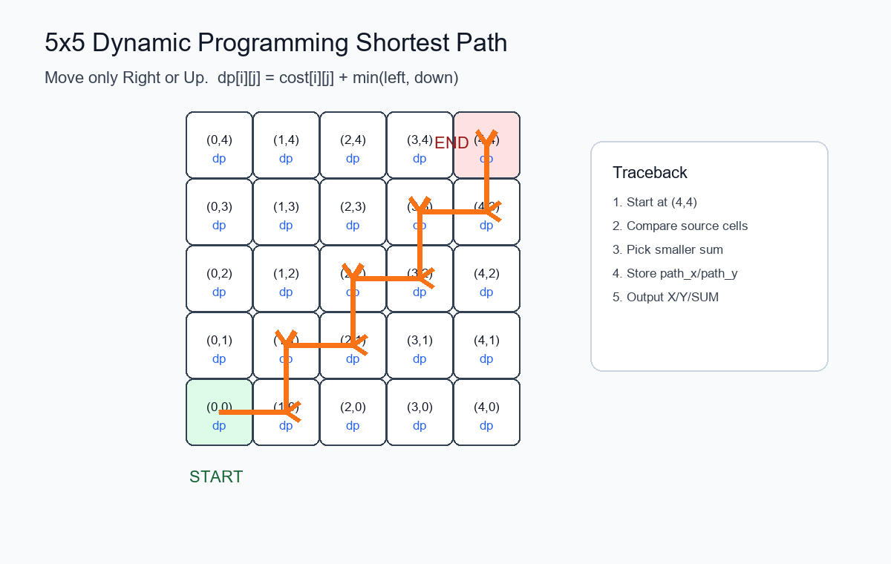
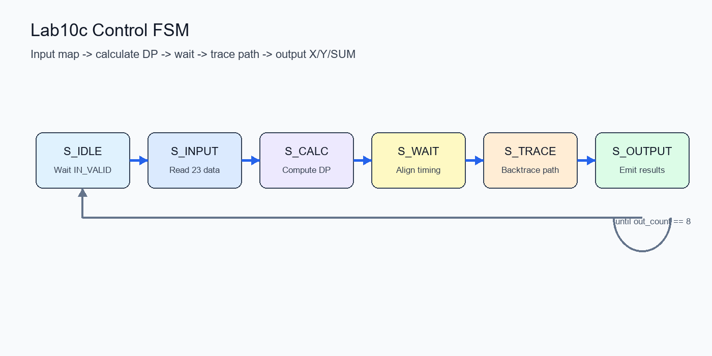

# Lab 10C：Finding Shortest Path in the 5x5 Matrix 實驗報告

| 項目 | 內容 |
| --- | --- |
| 課程 | VLSI / Verilog Simulation |
| 實驗 | Lab 10C：Finding Shortest Path in the 5x5 Matrix |
| 主題 | Dynamic Programming 最短路徑電路設計 |
| 工具 | `ncverilog`、`nWave`、Verilog HDL |

本報告整理 Lab 10C 的實驗目的、設計原理、狀態機流程、實作過程中遇到的困難與解決方法，以及最後的模擬結果。

## 一、實驗目的

本實驗目標為使用 Verilog 設計一個簡易 GPS 導引電路。電路需接收 5x5 matrix 中各點的距離資料，並從起點 `(0,0)` 找出到終點 `(4,4)` 的最短路徑。

最後電路需要依序輸出路徑上每一點的 X 座標、Y 座標與累積距離 `SUM`，並透過 testbench 與 nWave 波形驗證結果是否正確。

## 二、實驗原理

本題限制路徑只能往右或往上移動，因此可以使用 Dynamic Programming 的方式計算最短距離。定義 `dp[i][j]` 為從起點 `(0,0)` 到座標 `(i,j)` 的最短累積距離。

若在第一列或第一行，路徑只有單一路徑可走；若在一般位置，則比較左方與下方來源的累積距離，選擇較小者再加上目前點的距離值。

```text
dp[i][j] = cost[i][j] + min(dp[i-1][j], dp[i][j-1])
```

計算完成後，再由終點 `(4,4)` 往回 trace，回推最短路徑，最後依序輸出每個節點的 `X`、`Y` 與 `SUM`。



圖 1：5x5 matrix 使用 Dynamic Programming 計算最短路徑，並由終點回推輸出路徑。

## 三、設計流程與狀態機

本次設計以 FSM 控制整體流程，從輸入資料、計算 DP、等待時序穩定、回推路徑，到最後輸出答案。

| 狀態 | 功能說明 |
| --- | --- |
| `S_IDLE` | 等待 `IN_VALID` 拉高，準備接收地圖資料。 |
| `S_INPUT` | 依序接收 23 筆距離資料，並存入 `map` 陣列。 |
| `S_CALC` | 使用 DP 計算每個座標的最短累積距離。 |
| `S_WAIT` | 增加等待週期，避免計算與輸出時序重疊。 |
| `S_TRACE` | 由終點 `(4,4)` 回推到起點 `(0,0)`，建立 `path_x`、`path_y` 與 `path_sum`。 |
| `S_OUTPUT` | `OUT_VALID` 為 high 時，每個 clock 輸出一筆 `X`、`Y`、`SUM`。 |



圖 2：Lab 10C 控制 FSM，依序完成輸入、計算、回推與輸出。

## 四、遇到的困難與解決方法

### 1. 檔名大小寫錯誤

一開始執行 `ncverilog Test.v` 時，系統顯示找不到 `Test.v`。後來確認老師提供的檔案名稱是 `TEST.v`，Linux 對大小寫敏感，因此改用以下指令後才正確讀取 testbench。

```bash
ncverilog TEST.v
```

或使用 `run.f`：

```bash
ncverilog -f run.f
```

### 2. state 名稱未宣告

程式中曾出現 `INPUT`、`SUM`、`Trace` 等未宣告 identifier。原因是狀態名稱前後不一致，例如有些地方寫成 `INPUT`，有些地方寫成 `S_INPUT`。

最後統一使用以下狀態名稱：

```verilog
S_IDLE
S_INPUT
S_CALC
S_WAIT
S_TRACE
S_OUTPUT
```

### 3. output 不能在 always block 中賦值

一開始 `OUT_VALID`、`OUT_DATA_X`、`OUT_DATA_Y`、`OUT_DATA_SUM` 只有宣告成 `output`，導致在 `always` block 中賦值時出現 `net is not a legal lvalue`。

解決方式是將輸出訊號宣告成 `output reg`，使其可以在 `always` block 中被指定。

### 4. begin/end 配對錯誤

在撰寫 `if`、`else`、`for` 迴圈與 `case` 狀態機時，多次遇到 `expecting a statement` 或 `expecting endmodule` 的錯誤。

解決方式是使用行號工具逐段檢查 `begin` / `end` 是否成對。

```bash
nl -ba CHIP.v | sed -n '行數範圍p'
```

### 5. OUT_VALID 與輸出週期錯位

模擬一開始雖然可以編譯，但 testbench 顯示大量 `ERROR SUM`，代表輸出資料與正確答案檢查的 cycle 沒有對齊。

後來調整 `S_TRACE` 結束後的 `out_count` 起始值，並讓 `S_OUTPUT` 每個 clock 依序輸出 `path` 陣列資料，使輸出時序與 testbench 對齊。

### 6. SUM 輸出錯誤

原本 `OUT_DATA_SUM` 使用即時計算或錯誤索引，導致 `SUM` 與 testbench 的 `CORRECT_SUM` 不一致。

後來在 trace 完成後先建立 `path_sum`，再於 `S_OUTPUT` 中直接輸出 `path_sum[out_count]`，使 `X`、`Y`、`SUM` 三者對齊。

### 7. 最後 24 個錯誤反覆出現

即使路徑看起來正確，仍持續出現 24 個錯誤。後來使用 `$display` 印出 EXPECT 與 YOUR 的 `X/Y/SUM`，發現輸出序列與 testbench 檢查點錯位。

最後修正 `out_count` 與 `S_OUTPUT` 的輸出順序後，錯誤數歸零。

### 8. 使用 nWave 驗證波形

最後透過 nWave 開啟 `CHIP.fsdb` 並 restore `CHIP.rc`，觀察以下訊號：

| 類型 | 訊號 |
| --- | --- |
| 基本控制 | `CLK`、`RESET`、`IN_VALID`、`IN_DATA` |
| 輸出結果 | `OUT_VALID`、`OUT_DATA_X`、`OUT_DATA_Y`、`OUT_DATA_SUM` |
| 正確答案 | `CORRECT_X`、`CORRECT_Y`、`CORRECT_SUM` |
| 錯誤檢查 | `error_count` |

確認 `OUT_VALID` 為 high 時，輸出資料與正確答案一致。

## 五、模擬結果

完成修正後，重新執行 simulation：

```bash
ncverilog -f run.f
```

terminal 顯示三組 `SUCCESS`，代表三組 pattern 皆通過。nWave 波形中也可看到 `OUT_VALID` 拉高時，`OUT_DATA_X`、`OUT_DATA_Y`、`OUT_DATA_SUM` 與 `CORRECT_X`、`CORRECT_Y`、`CORRECT_SUM` 對應一致，表示最短路徑輸出正確。

| 驗證項目 | 結果 |
| --- | --- |
| Verilog 編譯 | 通過 |
| Testbench pattern | 三組皆 `SUCCESS` |
| `OUT_VALID` 時序 | 與 testbench 檢查週期對齊 |
| `OUT_DATA_X/Y/SUM` | 與正確答案一致 |
| nWave 驗證 | 波形確認輸出正確 |

## 六、關鍵 Verilog 程式片段

### State transition example

```verilog
always @(*) begin
    case(state)
        S_IDLE: begin
            if(IN_VALID)
                next_state = S_INPUT;
            else
                next_state = S_IDLE;
        end

        S_INPUT: begin
            if(IN_VALID && in_count == 5'd22)
                next_state = S_CALC;
            else
                next_state = S_INPUT;
        end

        S_CALC: begin
            next_state = S_WAIT;
        end

        S_WAIT: begin
            next_state = S_TRACE;
        end

        S_TRACE: begin
            next_state = S_OUTPUT;
        end

        S_OUTPUT: begin
            if(out_count == 4'd8)
                next_state = S_IDLE;
            else
                next_state = S_OUTPUT;
        end

        default: begin
            next_state = S_IDLE;
        end
    endcase
end
```

### Output stage

```verilog
S_OUTPUT: begin
    OUT_VALID = 1'b1;
    OUT_DATA_X = path_x[out_count];
    OUT_DATA_Y = path_y[out_count];
    OUT_DATA_SUM = path_sum[out_count];

    if(out_count == 4'd8) begin
        out_count <= 4'd0;
    end
    else begin
        out_count <= out_count + 4'd1;
    end
end
```

## 七、結論

本次實驗成功完成 5x5 matrix 最短路徑電路設計，並以 Verilog 行為層級描述完成資料輸入、DP 計算、路徑回推與輸出控制。

在 debug 過程中，除了修正語法錯誤，也學會透過 testbench 訊息與 nWave 波形定位時序問題。最後模擬結果顯示 `SUCCESS`，代表設計符合題目要求。
