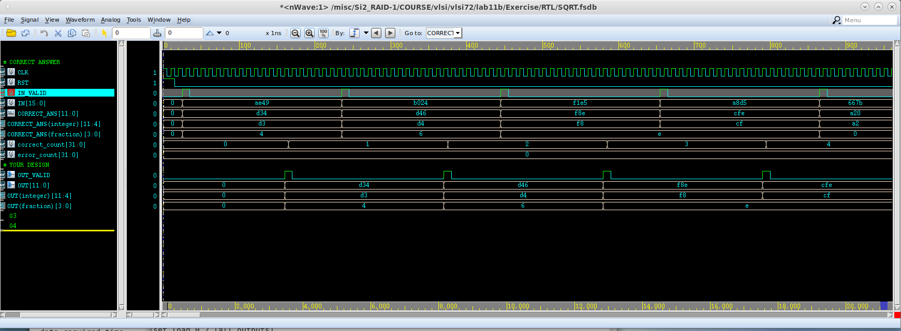
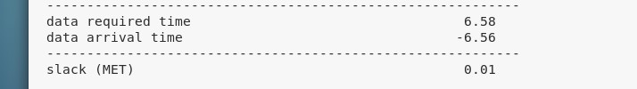
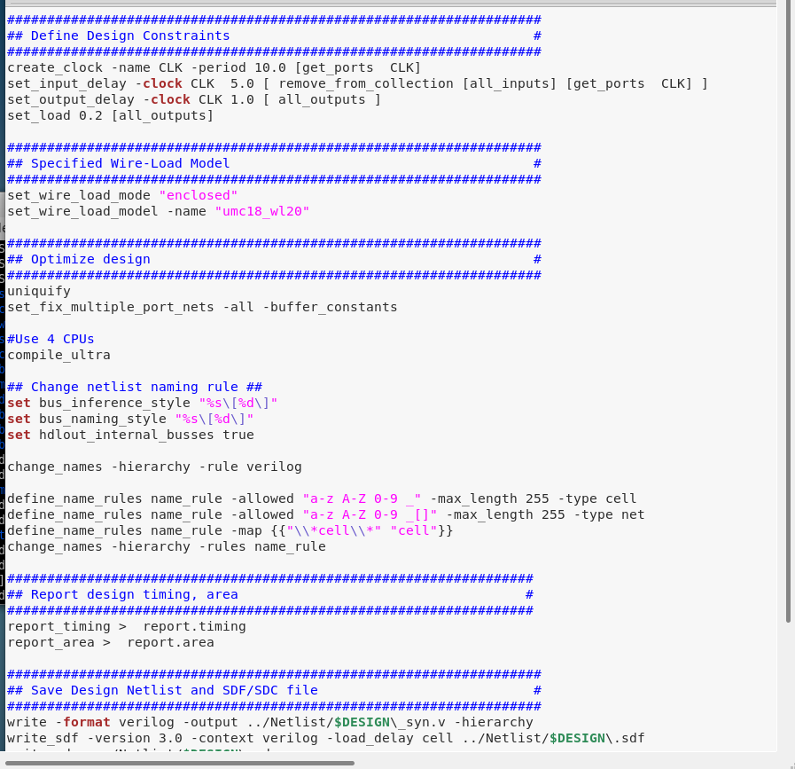
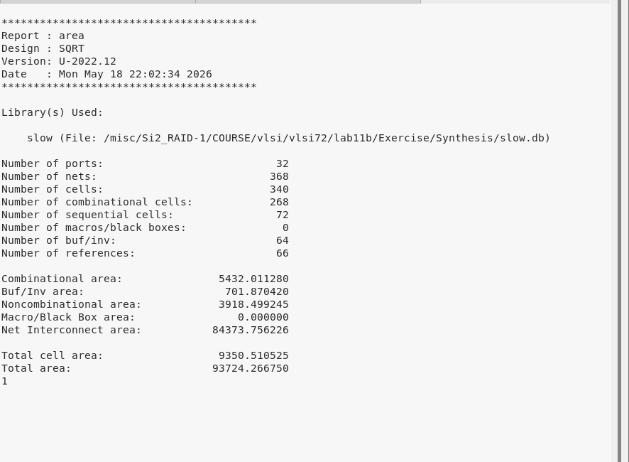
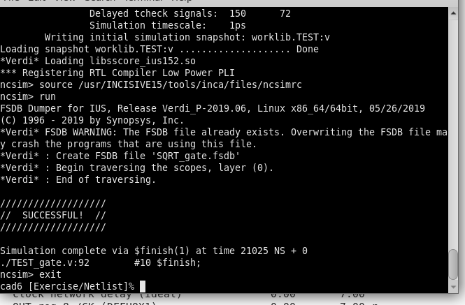

# Lab 11B：SQRT Circuit 實驗報告

| 項目 | 內容 |
| --- | --- |
| 課程 | CSIE VLSI Lab 2026 |
| 實驗 | Lab 11B：Design a Square Root Circuit |
| 姓名 | 許禕恩 / Ian Hsu |
| 學號 | 614530038 |
| 實驗主題 | 使用 Verilog 設計 16-bit unsigned input 的平方根電路，並完成 RTL simulation、nWave 波形除錯、Synthesis 與 Gate-level simulation。 |

## 一、實驗目的

本次實驗主要目的為使用 Verilog behavior-level HDL 設計一個平方根電路，並透過 RTL simulation、nWave 波形觀察、邏輯合成以及 gate-level simulation 驗證設計是否正確。

本實驗的輸入為 16-bit unsigned integer，輸出為 12-bit unsigned fixed-point number。輸出格式中，高 8 bits 代表整數部分，低 4 bits 代表小數部分。因此，本電路需要計算輸入數值的平方根，並以固定小數點格式輸出。

```text
OUT / 16 = sqrt(IN)
OUT = round(sqrt(IN) * 16)
```

為了得到 4-bit fraction 的平方根結果，可以將輸入先放大 256 倍後再開根號：

```text
sqrt(IN * 256) = sqrt(IN) * 16
```

## 二、實驗規格

本次設計的 top module 名稱為 `SQRT`，檔案名稱為 `SQRT.v`。所有訊號皆同步於 clock rising edge，reset 為 active high synchronous reset。

| Signal Name | Direction | Bit Width | Description |
| --- | --- | --- | --- |
| `CLK` | Input | 1 | Clock signal，synchronous at rising edge |
| `RST` | Input | 1 | Synchronous reset，active high |
| `IN_VALID` | Input | 1 | Asserted when `IN` is valid |
| `IN` | Input | 16 | Unsigned input integer |
| `OUT_VALID` | Output | 1 | Asserted when `OUT` is valid |
| `OUT` | Output | 12 | Fixed-point square-root result |

`OUT[11:4]` 為整數部分，`OUT[3:0]` 為小數部分，因此 `OUT` 代表的實際數值為 `OUT / 16`。

## 三、設計方法與原理

本次設計使用逐步運算的平方根演算法，不使用 Chipware 或 DesignWare 元件。由於題目限制不能直接使用現成 IP，因此所有運算皆以可合成的 Verilog RTL 完成。

平方根演算法的核心概念為每一個 clock cycle 決定平方根結果的一個 bit。因為輸出需要 12-bit fixed-point 結果，且為了讓結果符合四捨五入，內部多計算一個 fraction bit，因此使用 13-bit `root` 進行運算。

| 暫存器 / 訊號 | 功能說明 |
| --- | --- |
| `radicand` | 儲存放大後的輸入資料，例如 `{IN, 10'b0}`。 |
| `remainder` | 平方根逐步運算過程中的餘數。 |
| `root` | 目前計算出的平方根結果。 |
| `valid_pipe` | 用來控制 `OUT_VALID`，使輸出能在規定 cycle 內被測試平台偵測。 |

主要運算流程如下：

```verilog
rem_shift = {remainder[13:0], radicand[25:24]};
trial     = {1'b0, root, 2'b01};

if (rem_shift >= trial) begin
    rem_next  = rem_shift - trial;
    root_next = {root[11:0], 1'b1};
end
else begin
    rem_next  = rem_shift;
    root_next = {root[11:0], 1'b0};
end
```

每一輪會取 `radicand` 最高的 2 bits 與 `remainder` 合併後進行比較與減法，藉此決定 `root` 的下一個 bit 要填 1 或 0。最後再用多算出的最低 bit 作為 rounding bit，使輸出結果符合 testbench 的 `CORRECT_ANS`。

## 四、SQRT.v 程式碼

以下為本次實驗完成的 `SQRT.v`：

```verilog
`timescale 1ns/10ps

module SQRT(
    RST,
    CLK,
    IN_VALID,
    IN,
    OUT_VALID,
    OUT
);

input CLK;
input RST;
input [15:0] IN;
input IN_VALID;
output reg [11:0] OUT;
output reg OUT_VALID;

// Write your synthesizable code here

reg [25:0] radicand;
reg [15:0] remainder;
reg [12:0] root;

reg [12:0] valid_pipe;

reg [15:0] rem_shift;
reg [15:0] trial;
reg [15:0] rem_next;
reg [12:0] root_next;
reg [12:0] rounded;

// combinational logic
always @(*) begin
    rem_shift = {remainder[13:0], radicand[25:24]};
    trial     = {1'b0, root, 2'b01};

    if (rem_shift >= trial) begin
        rem_next  = rem_shift - trial;
        root_next = {root[11:0], 1'b1};
    end
    else begin
        rem_next  = rem_shift;
        root_next = {root[11:0], 1'b0};
    end

    rounded = {1'b0, root_next[12:1]} + root_next[0];
end

// sequential logic
always @(posedge CLK) begin
    if (RST) begin
        radicand   <= 26'd0;
        remainder  <= 16'd0;
        root       <= 13'd0;
        valid_pipe <= 13'd0;
        OUT        <= 12'd0;
        OUT_VALID  <= 1'b0;
    end
    else begin
        OUT_VALID  <= 1'b0;
        valid_pipe <= {valid_pipe[11:0], IN_VALID};

        if (IN_VALID) begin
            radicand  <= {IN, 10'b0};
            remainder <= 16'd0;
            root      <= 13'd0;
        end
        else if (|valid_pipe) begin
            remainder <= rem_next;
            root      <= root_next;
            radicand  <= {radicand[23:0], 2'b00};

            if (valid_pipe[12]) begin
                if (rounded > 13'd4095)
                    OUT <= 12'hFFF;
                else
                    OUT <= rounded[11:0];

                OUT_VALID <= 1'b1;
            end
        end
    end
end

endmodule
```

## 五、實驗流程

### 1. 進入 Exercise/RTL 並確認檔案

```bash
cd ~/lab11b/Exercise/RTL
ls
```

`Exercise/RTL` 資料夾中包含 `TEST.v`、`SQRT.v`、`SQRT.rc`、`cleanup` 與 `run.f`。其中 `SQRT.v` 是本次要完成的設計檔案，`TEST.v` 是測試平台，`SQRT.rc` 是 nWave 的訊號設定檔，`run.f` 是 ncverilog simulation script。

### 2. 編輯 SQRT.v

```bash
gedit SQRT.v &
```

在 `SQRT.v` 中，`OUT` 與 `OUT_VALID` 會在 `always @(posedge CLK)` 區塊中被指派，因此需要宣告為 `reg`。這不改變題目指定的 I/O 名稱或 bit width，只是符合 Verilog 語法與合成需求。

```verilog
output reg [11:0] OUT;
output reg OUT_VALID;
```

### 3. 執行 RTL simulation

```bash
ncverilog -f run.f
```

執行後 terminal 顯示 `SUCCESSFUL`，代表 RTL simulation 通過測試。此結果表示 RTL 層級下的 `SQRT` 電路能在 `OUT_VALID` 為高時輸出正確平方根結果。

## 六、nWave 波形觀察與 Debug

完成 RTL simulation 後，使用 nWave 開啟 `SQRT.fsdb`，並透過 `SQRT.rc` 還原觀察訊號。

```bash
nWave &
```

```text
File -> Open -> SQRT.fsdb
File -> Restore Signal -> SQRT.rc
```

主要觀察訊號包含 `CLK`、`RST`、`IN_VALID`、`IN`、`CORRECT_ANS`、`OUT_VALID`、`OUT`、`correct_count` 與 `error_count`。



圖 1：RTL simulation nWave 波形，`OUT_VALID` 為高時 `OUT` 與 `CORRECT_ANS` 相同。

由圖 1 可觀察到，當 `IN_VALID` 拉高時，輸入資料 `IN` 被送入 `SQRT` 電路。經過數個 clock cycle 後，`OUT_VALID` 拉高，代表 `OUT` 輸出有效。在 `OUT_VALID` 為高電位時，`OUT` 與 `CORRECT_ANS` 相同，例如 `CORRECT_ANS = d34` 時 `OUT = d34`，下一筆 `CORRECT_ANS = d46` 時 `OUT = d46`。

同時，`correct_count` 持續增加，而 `error_count` 維持為 0，表示測試平台判定每筆輸出皆正確。因此，本設計已完成 nWave waveform debug，且 RTL simulation 驗證成功。

## 七、Synthesis 合成

RTL simulation 成功後，進入 `Synthesis` 資料夾執行合成。

```bash
cd ../Synthesis
./01_run_synthesis
```

合成完成後會產生 `report.timing`、`report.area`、`SQRT_syn.v`、`SQRT.sdf` 等檔案。

| 檔案 | 說明 |
| --- | --- |
| `report.timing` | Timing report，用來確認時序是否滿足 constraint。 |
| `report.area` | Area report，用來觀察合成後 cell 數量與面積。 |
| `SQRT_syn.v` | 合成後的 gate-level Verilog netlist。 |
| `SQRT.sdf` | Standard Delay Format，用於 gate-level timing simulation。 |

## 八、Timing Report 與 Area Report

### 1. Timing Report

```bash
gedit report.timing &
```

Timing report 最後顯示 slack `(MET)`，代表 setup timing constraint 已經滿足。本次報告中 slack 為 `0.01`，表示時序雖接近臨界，但仍符合 timing 要求。



圖 2：Timing report 顯示 slack `(MET) 0.01`。

在實驗過程中，gate-level simulation 曾出現 timing violation。為了讓合成結果更穩定，後續在 synthesis script 中將 clock period 設定得更嚴格，並加入 `set_fix_hold` 進行 hold timing 修正。



圖 3：Synthesis constraint 設定，包括 clock、input/output delay 與 `set_fix_hold`。

```tcl
create_clock -name CLK -period 7.0 [get_ports CLK]
set_fix_hold [get_clocks CLK]
set_input_delay -clock CLK 2.0 [ remove_from_collection [all_inputs] [get_ports CLK] ]
set_output_delay -clock CLK 1.0 [ all_outputs ]
```

### 2. Area Report

```bash
gedit report.area &
```

Area report 顯示合成後電路的 cell 數量與面積資訊，例如 `Number of cells`、`Number of combinational cells`、`Number of sequential cells`、`Total cell area` 與 `Total area`。這些數值反映出平方根電路的硬體成本。



圖 4：Area report，顯示合成後的 cell 數量與 area 資訊。

## 九、Gate-level Simulation

完成 synthesis 後，進入 `Netlist` 資料夾執行 gate-level simulation。

```bash
cd ../Netlist
ncverilog -f run.f
```

最後 terminal 顯示 `SUCCESSFUL`，表示合成後的 gate-level netlist 通過測試。這代表設計不只在 RTL 層級正確，轉換為 gate-level 電路後仍能正確運作。



圖 5：Gate-level simulation 結果顯示 `SUCCESSFUL`。

## 十、問題與解決方式

### 1. OUT / OUT_VALID 需要宣告為 reg

一開始 `OUT` 與 `OUT_VALID` 使用一般 `output` 宣告，但因為它們在 sequential always block 中被指定，所以必須宣告為 `output reg`。否則 Verilog 會出現 left hand side 不能指定或 undeclared / illegal assignment 類型錯誤。

```verilog
output reg [11:0] OUT;
output reg OUT_VALID;
```

### 2. 結果差一個 LSB

初版設計使用無條件捨去，因此部分測資與正確答案相差 `0.0625`，也就是 fixed-point 輸出的 1 LSB。後來改為多計算 1 個 fraction bit，再使用最低 bit 進行四捨五入，使結果符合 `CORRECT_ANS`。

```verilog
rounded = {1'b0, root_next[12:1]} + root_next[0];
```

### 3. Gate-level simulation 的 OUT_VALID 問題

在 debug 過程中，gate-level simulation 曾出現 `OUT_VALID DOESN'T ASSERT`。檢查 `TEST_gate.v` 後可知，測試平台會在每筆輸入後的 20 個 clock cycle 內等待 `OUT_VALID`。後續透過 valid pipeline 控制 `OUT_VALID`，使其能在指定時間內正確輸出。

### 4. Gate-level timing violation

後續 gate-level simulation 曾出現 timing violation，導致 `OUT` 變成 `X`。檢查 timing report 後發現 slack 非常接近 0，因此修改 synthesis constraint，使合成器用較嚴格的 clock period 進行最佳化，並加入 `set_fix_hold` 修正 hold timing。修正後 gate-level simulation 成功通過。

## 十一、實驗結果整理

| 項目 | 結果 |
| --- | --- |
| `SQRT.v` RTL code | 完成 |
| RTL simulation | `SUCCESSFUL` |
| nWave waveform debug | 完成，`OUT_VALID` 為高時 `OUT = CORRECT_ANS` |
| Synthesis | 完成，產生 `SQRT_syn.v` 與 `SQRT.sdf` |
| Timing report | slack `(MET)` |
| Area report | 完成檢查 |
| Gate-level simulation | `SUCCESSFUL` |

## 十二、心得

透過本次實驗，我學習到從 RTL 設計到 gate-level simulation 的完整流程。這次設計的平方根電路雖然在 RTL simulation 中可以正確運作，但合成後仍可能遇到 timing violation 或 `OUT_VALID` 時序不穩定的問題。因此，僅通過 RTL simulation 並不代表整個電路已經完成，還必須透過 synthesis、timing report、area report 以及 gate-level simulation 進一步驗證。

此外，本次實驗也讓我更熟悉 nWave 的使用方式。透過觀察 `IN_VALID`、`OUT_VALID`、`OUT`、`CORRECT_ANS`、`correct_count` 與 `error_count` 等訊號，可以更清楚地判斷電路是否正確運作。當 `OUT_VALID` 為高時，若 `OUT` 與 `CORRECT_ANS` 相同，且 `correct_count` 持續增加、`error_count` 維持為 0，即可確認設計結果正確。

整體而言，本次實驗讓我更了解數位電路設計不只是撰寫 Verilog code，也包含模擬驗證、波形 debug、邏輯合成與 timing 檢查等完整流程。這些步驟對於實際 IC design flow 非常重要。
